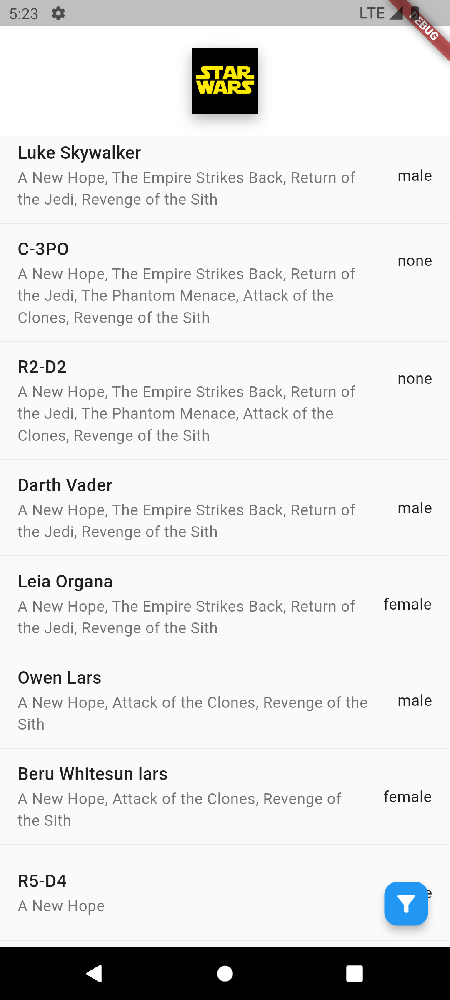
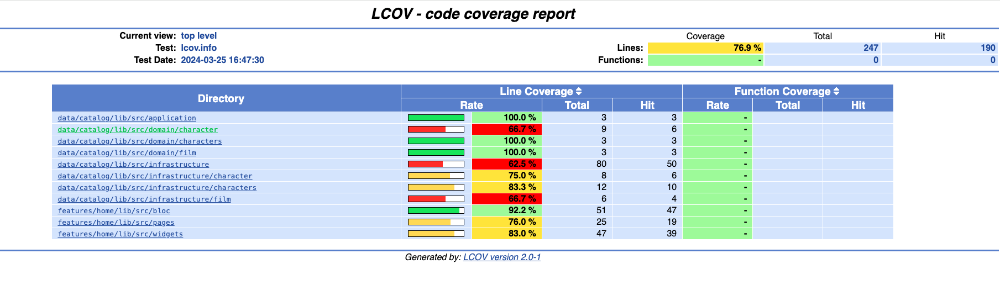

# Star Wars Characters App

This Flutter application provides a comprehensive list of Star Wars characters.

For this poject Clean Architecture was choosen.  Beacause keep the code clean and tested are the two most important development practices. Even state management patterns like BLoC are not sufficient in themselves to allow for easily extendable codebase. If you want to learn more about this, you can read my article [here](https://medium.com/@alvaro.armijoss/improve-your-flutter-development-with-clean-architecture-and-tdd-4c13e6af4f18 "here").

For this we should all strive to separate code into independent layers and depend on abstractions instead of concrete implementations.

Every "Date module" of the app, like Catalog, is divided into 3 layers - presentation, domain and infrastructure.

The presentation layer("Features") contain Pages, Widgets and Bloc. 

The data layer contain Entities, Repositories and Usecases. It should be totally independent of every other layer. The data layer consists of a Repository implementation and data sources - this is usually for getting remote (API) data.


<p>
     
     
</p>

<p>
     
</p>

## Features

- Display all Star Wars characters with their respective details, including:
    * Name
    * Films appeared in
    * Gender
- Filter characters by gender
- Reactive rotation of the application logo in the center of the screen based on the device's gyroscope movements using platform channels.

# Starting 🚀

These instructions will allow you to obtain a copy of the application for testing.

## Getting Started
To build and run this project:

1. Get Flutter [here](https://flutter.dev) if you don't already have it
2. Clone this repository `git clone https://github.com/alvaroarmijos/star_wars`
3. `cd` into the repo folder `cd star_wars`
4. Install melos `dart pub global activate melos`
5. Bootstrap your project `melos bootstrap`
4. Sync the project `melos sync`
6. run `flutter run` to run the app.


## Running the example code

This sample requires Flutter 3.0.5

## Running Tests

The test coverage of this application is 76,9%.

<p>
     
</p>

All you have to do is to run these three commands:

```
# Note: on macOS you need to have lcov installed on your system (`brew install lcov`)
# Add permission to scripts
chmod 777 scripts/combine_coverage.sh
#Generate Test Coverage
melos gen_coverage
# Open the report
open coverage_report/html/index.html
```

## Requirements 📋
You need these packages for the application to work
- Service Locator for DI: [get_it](https://pub.dev/packages/get_it "get_it")
- State management: [flutter_bloc ](https://pub.dev/packages/flutter_bloc "flutter_bloc ")
- To implement value based equality without needing to explicitly override == and hashCode: [equatable](https://pub.dev/packages/equatable "equatable")
- For making HTTP requests: [http](https://pub.dev/packages/http#-installing-tab- "http")
- Mock library which simplifies mocking with null safety support and no manual mocks or code generation: [mocktail ](https://pub.dev/packages/mocktail "mocktail ")
- A testing library which makes it easy to test blocs: [bloc_test ](https://pub.dev/packages/bloc_test "bloc_test ")


# Built with 🛠️
  - [Flutter](https://flutter.dev/ "flutter")
  - [Swapi](https://swapi.dev/)
